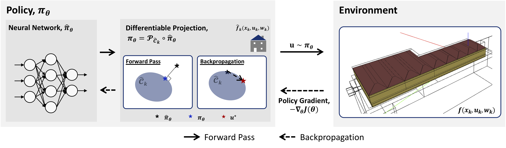

# PROF: Projected Feasibility

This is the official repository that implements the following paper:

> *Chen, Bingqing, Priya Donti, Kyri Baker, J. Zico Kolter, and Mario Berges. "Enforcing Policy Feasibility Constraints through Differentiable Projection for Energy Optimization." In Proceedings of the Twelfth ACM International Conference on Future Energy Systems (e-energy '21). pp. 199–210. 2021.*

[[slides]](docs/slides.pdf)[[paper]](https://dl.acm.org/doi/10.1145/3447555.3464874) 
<!--- [[video]](https://www.youtube.com/watch?v=rH64WyPHCVE) ---> 
# Overview

PROjected Feasibility (PROF) is a method to enforce convex operational constraints within neural policies, by incorporating a differentiable projection layer within a neural network-based policy to enforce that all learned actions are feasible. We then update the policy end-to-end by propagating gradients through this differentiable projection layer, making the policy cognizant of the operational constraints. The result is a powerful neural policy that can flexibly optimize performance on the true underlying dynamics, while still satisfying the specified constraints.

We demonstrate our method on two applications: energy-efficient building operation and inverter control. 
- In the building control case, PROF outperforms other RL agents, while maintaining temperature within the deadband except when the control is saturated.
- In the inverter control setting, PROF satisfies the constraints 100% of the time and minimizes curtailment as well as possible within its conservative safe set after learning safely for half a day.

**Framework.** 




# Code Usage
### Clone repository
```
git clone https://github.com/INFERLab/PROF.git
cd PROF
```

### Set up the environment 
Set up the virtual environment with your preferred environment/package manager.

The instruction here is based on **conda**. ([Install conda](https://docs.anaconda.com/anaconda/install/))
```
conda env create --file environment.yml 
condo activate nn-w-proj
```

### File Structure
```
.
├── agents
│   ├── base.py             # Implement a controller that instantiate the projection problem given building parameters
│   └── nn_policy.py        # Inherit the controller from base.py; Forward pass: NN + Differentiable projection
│   └── inverter_policy.py  # Policy for inverter: NN + Differentiable projection
├── algo                    
│   └── ppo.py	 	    # A PPO trainer 
├── env
│   └── inverter.py         # Implements the IEEE 37-bus case
├── utils
│   ├── network.py          # Implements neural network modules, e.g. MLP and LSTM
│   └── ppo_utils.py        # Helper function for PPO trainer, e.g. Replay_Memory, Advantage_func
├── network		    # Matlab code for linearizing grid model; Data to construct IEEE 37-bus case;
└── mypypower		    # Include some small changes from PyPower source code to allow customization

```

### Running
You can replicate our experiments for *Experiment 1: Energy-efficient Building Operation* with `main_IW.py` and *Experiment 2: Inverter Control* with `main_inverter.py`


### Feedback

Feel free to send any questions/feedback to: [Bingqing Chen](mailto:bingqinc@andrew.cmu.edu)

### Citation

If you use PROF, please cite us as follows:

```
@inproceedings{chen2021enforcing,
author = {Chen, Bingqing and Donti, Priya L. and Baker, Kyri and Kolter, J. Zico and Berg\'{e}s, Mario},
title = {Enforcing Policy Feasibility Constraints through Differentiable Projection for Energy Optimization},
year = {2021},
isbn = {9781450383332},
publisher = {Association for Computing Machinery},
address = {New York, NY, USA},
url = {https://doi.org/10.1145/3447555.3464874},
doi = {10.1145/3447555.3464874},
booktitle = {Proceedings of the Twelfth ACM International Conference on Future Energy Systems},
pages = {199–210},
numpages = {12},
keywords = {inverter control, safe reinforcement learning, implicit layers, differentiable optimization, smart building},
location = {Virtual Event, Italy},
series = {e-Energy '21}
}
```
